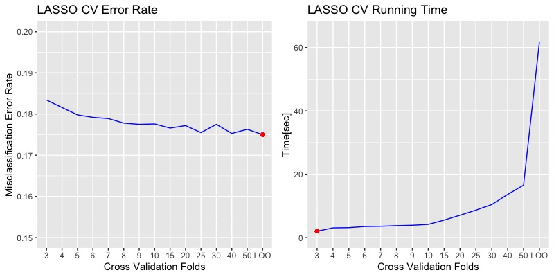
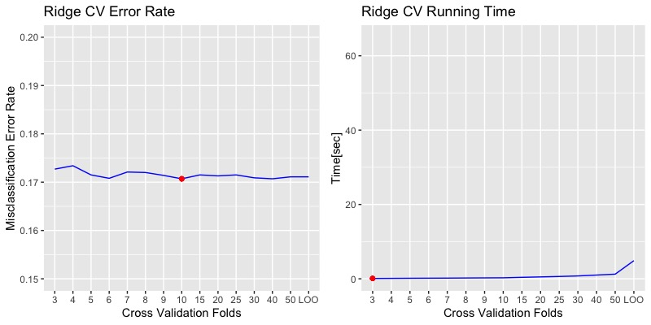
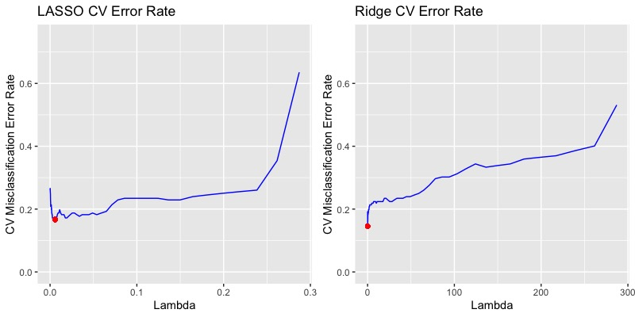
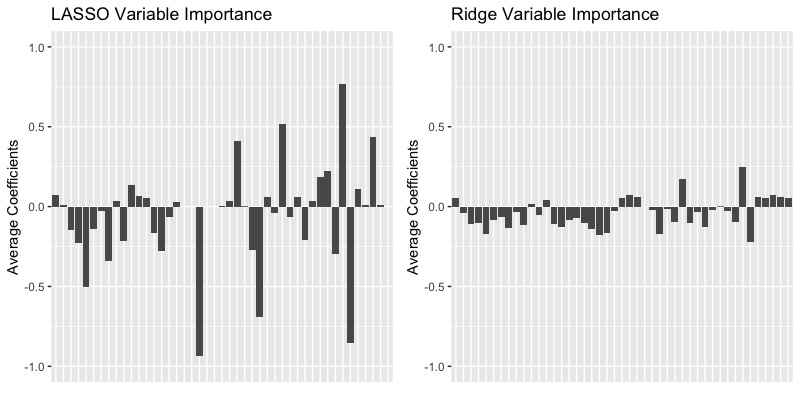
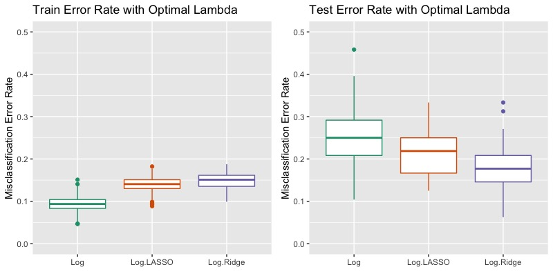

# Parkinson Disease Diagnosis from Acoustic Features

Soonmo Seong (soonmo.seong@gmail.com)

Dec 27th, 2019

[Analysis Report](https://drive.google.com/open?id=1yRHq5az0IVvgjua4vYC9QhZMcF_5ndWl)

[R Code](https://drive.google.com/open?id=1KH9FjngsPXtv8BFuG1kuIMuzNKqZp8Rb)

[R Code PDF](https://drive.google.com/open?id=1hnQoRyjMFT54xps70zTOM7orCEPhdB0L)

## Brief Summary

This is a brief summary of the project. If you want to know more, please refer to the linked analysis report and R code as above.

### Concept of Analysis

The purpose is to predict the positiveness of the Parkinson disease from voice-related data of participants such as pitch periods, voice noise, and perturbation. Important variables will be discussed in detail.

In order to select the best classification method for this data set, we compare three methods in terms of misclassification error rate by 100 itereations.

- Logistic Regression
- LASSO Logistic Regression
- Ridge Logistic Regression

The lasso and ridge logistic regression has a hyperparameter that controls the prediction ability, so we tune the hyperpameter optimally by cross validation. We will evaluate the optimal number of folds for cross validation and the optimal value for hyperparameters.

We first standardize the dataset. Then, this dataset randomly splits into n_train and n_test. n_train is 0.8n, and n_test is 0.2n.

- n_train = 192
- n_test = 48

We can estimate the true misclassification error rate from the n_test. In order to compare the prediction ability, we mainly use misclassification error rates from 100 iterations of each method.

### Data Description

This data comes from [UCI Machine Learning repository](https://archive.ics.uci.edu/ml/datasets/Parkinson+Dataset+with+replicated+acoustic+features+). The sample size of the data set is 240, meaning that there are 240 observations. Each observation has 44 variables, most of which are acoustic features. Half of the participants has the Parkinson disease, and the other half does not. So, this dataset is balanced. We don't need to consider imbalance of the dataset.

### Correlation Analysis

As shown above, similar acoustic features have strong positive correlations, which is close to one. For example, Mel frequency cepstral coefficients and their derivatives(MFCC and Delta) have strong correlations. However, different acoustic features are almost uncorrelated such as Mel frequency cepstral coefficients and Pitch period entropy(PPE).

Surprisingly, Harmonic-to-noise ratios are highly, positively correlated with Mel frequency cepstral coefficients and their derivatives. Negative correlations are not recognized noticeably.

### Performance Comparison between Logistic, LASSO, and Ridge by 10 Fold Cross Validation

Commonly, 10-folds cross validation is known as the best. Each box plot comes from 100 iterations for each algorithm. Unlike the logistic regression, lasso and ridge regression are not overfitted since the train error rates are close to the test error rate. The hyperparameter is chosen by the 10 folds cross validation.

The cross validation error rate with 10 folds is also a good estimate of the test error rate for the lasso and ridge regression as we can see. We evaluate the number of folds in next sections.

#### Optimal K Fold Cross Validation for LASSO Regression

We will conduct an experiments to decide what number of folds is the best for reducing the misclassification error rate. 15 types of folds will be tested from 3 folds to Leave-One-Out cross validation.

The error rates and time above are the average of 100 iterations of lasso logistic regression. The minimum value is marked as a red point. As the number of folds increase, the cross validation misclassification error rate converges to 17.5 percentage.25 folds, 40 folds, and LOO cross validation show the similar error rates each other. So, **25 folds cross validation for the lasso regression is the best choice** with respect to the trade-off between time and error rates.

#### Optimal K Fold Cross Validation for Ridge Regression

**10 fold cross validation is the best for the ridge regression** as shown above. Interestingly, increasing the number of folds doesn't improve the cross validation error rate. We don't need to consider the time to run the cross validation because the LOO cross validation, which takes the longest time to run, takes only less than 10 seconds.

In this dataset, **the ridge regression takes much shorter time to cross validate than does the lasso regression in general**.

#### Optimal Hyperparameters for LASSO and Ridge Regression

**The best hyperparameter, lambda, for the lasso regression is 0.0058, and that for the ridge regression is 0.1272.** The lowest cross validation error rate is marked as a red dot.

#### Variable Importance

Regarding the variable importance, there are similar patterns in the lasso and ridge regression. The order of variables doesn't change in the x axis. Some variables with negative coefficients in the lasso regression tend to have negative coefficients in the ridge regression.

Top 5 Positive and Negative Coefficient Variables in LASSO

| Top 5      | Positive | Top 5   | Negative |
| :--------- | -------: | :------ | -------: |
| PPE        |     0.77 | HNR35   |    -0.93 |
| MFCC2      |     0.52 | RPDE    |    -0.85 |
| Shim_APQ5  |     0.44 | MFCC10  |    -0.69 |
| Jitter_rel |     0.41 | Delta11 |    -0.50 |
| MFCC8      |     0.22 | Delta3  |    -0.34 |

Top 5 Positive and Negative Coefficient Variables in Ridge

| Top 5      | Positive | Top 5   | Negative |
| :--------- | -------: | :------ | -------: |
| PPE        |     0.25 | RPEDE   |    -0.22 |
| MFCC2      |     0.18 | HNR35   |    -0.17 |
| Shim_APQ5  |     0.08 | MFCC10  |    -0.17 |
| Jitter_RAP |     0.07 | Delta11 |    -0.17 |
| Shim_dB    |     0.06 | HNR38   |    -0.16 |

In the tables above, **Top 3 are the same in the lasso and ridge regression regardless of the sign of the coefficients of variables**.

**Top 3 important positive variables are PPE, MFCC2, and ShimAPQ5.**

PPE is a new measurement of pitch variation in voice. MFCC2 is the second coefficient of MFC, the mel-frequency cepstrum (MFC). MFC is a representation of the short-term power spectrum of a sound, based on a linear cosine transform of a log power spectrum on a nonlinear mel scale of frequency. ShimAPQ5 is a measurement of perturbation to the small, rapid, cycle-to-cycle changes of period in the fundamental frequency of the voice and 5 point amplitude that occur during phonation.

Pitch variation has the most positive contribution to the Parkinson disease diagnosis detection. In other words, if a patient has a big pitch variation, he or she is more likely to be diagnosed to have the Parkinson disease. The second coefficient of MFC is the second most positive contribution to the Parkinson disease diagnosis, and the third most positive contribution is the changes of period in the fundamental frequency of voice and 5 point amplitude.

**Top 3 important negative variables are HNR35, RPDE, and MFCC10.**

HNR35 is a harmonic-to-noise ratio in the frequency band of 0-3500 Hz. RPDE is an acronym of Recurrence period density entropy for determining the periodicity, or repetitiveness of a signal. MFCC10 is the tenth coefficient of MFC previously explained in the important positive variables.

The harmonic-to-noise ratio in 0-3500 Hz has the most negative contribution to the Parkinson disease diagnosis detection. That is to say, if a patient has a high value of harmonic-to-noise ratio in the frequency range, the patient is less likely to have the Parkinson disease. The repetitiveness of a voice signal is the second most negative contribution, and the tenth coefficient of MFC is the third. Interestingly, the second coefficient of MFC is the second most positive important variable while the tenth coefficient of MFC is the third most negative important variable. So, MFC, a representation of the short-term power spectrum of a sound, has positive and negative contribution to the Parkinson disease diagnosis.

### Best Method between Logistic, LASSO, and Ridge Regression

**The best method for this dataset is the ridge logistic regression with hyperparameter = 0.1272 chosen by 10 fold cross validation.**

### Model Fit

Instead of n_train = 0.8n = 192, When we use the full dataset of n = 240 for the ridge regression with hyperparameter = 0.1272, the train error rate is 0.146. The train error rate of 0.146 is underestimated the true misclassification error rate, implying that the true misclassification error rate from a new dataset of new patients definitely expected to be higher than the train error rate. However, since the ridge regression is less overfitted than other methods and the test error rate from n_test = 0.2n = 4 is just slightly higher than the train error rate from n_train = 0.8n = 192, the true misclassification error rate of the new dataset wouldn't be much worse than the train error rate from the full dataset of n = 240.

Confusion Matrix for Ridge Regression

|                    | True Negative | True Positive |
| :----------------- | ------------: | ------------: |
| Predicted Negative |           102 |            17 |
| Predicted Positive |            18 |           103 |

As the dataset is balanced, the confusion matrix of the ridge regression is also balanced. That means that the prediction have false negative and false positive evenly.

## Conclusion

The ridge logistic regression with hyperparameter = 0.1272 is the best method for this dataset since the ridge regression is not overfitted too much and has the best estimate of the true misclassification error rate. In other words, **the train error rate of 0.146 from the full dataset can be a good estimate for the true misclassification error rate when we face a new dataset**. For example, when we diagnose 100 new patients with this ridge logistic regression model, the misclassification error rate would be around 15 percentage. In addition to the prediction accuracy, this model doesn't spend too much time to cross validate and train the model because we already consider the trade-off between time and error rate. In particular, this dataset requires less than 5 second to cross validate with 10 folds.

We tune the hyperparameter, lambda. When we tune the hyperparameter of the ridge logistic regression, we implement the cross validation method. However, we eclectically choose 10-fold cross validation. We compare 15 types of cross validation folds from 3 fold to LOO cross validation by taking the average of 100 iterations of cross validation error rates. Of 15 types of the folds, 10-fold cross validation is the best one that gives the best hyperparameter, hyperparameter = 0.1272.
